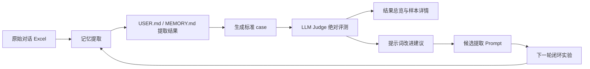

# MemoryEvalUI 团队 Wiki 总览

## 1. 系统简介

MemoryEvalUI 是一个面向 USER.md 用户画像和 MEMORY.md 长期记忆的本地评测与闭环实验系统。它用于把记忆提取结果转换为标准评测 case，通过 LLM Judge 做结构化绝对评测，再基于评测证据生成候选 Prompt 修改建议，支持后续多轮闭环实验。

系统主线不是“自动上线 Prompt”，而是“基于证据生成候选版本，人工复核后再采用”。

多人使用时，首次进入需填写工号和姓名。系统据此创建独立工作区，隔离配置、提示词、上传文件、任务和结果。它不是密码认证，VM 入口仍需由 VPN、反向代理或统一身份认证保护。

## 2. 适用场景

- 批量评估 USER.md 用户画像提取质量。
- 批量评估 MEMORY.md 长期记忆提取质量。
- 对比不同提取 Prompt 或 Judge Prompt 的结果差异。
- 分析低分样本、错误标签、规则引用和证据引用。
- 基于评测结果生成候选 Prompt 修改建议。
- 做小样本多轮闭环实验，验证 Prompt 是否朝正确方向改进。

## 3. 核心流程



如果已经有提取结果 Excel，可以从“评测数据”直接进入“生成标准 case”，不必重新跑记忆提取。原始对话 Excel 只进入“记忆提取”，两类输入不会在同一页面混用。

## 4. 页面功能说明

| 页面 | 作用 |
| --- | --- |
| 配置 | 配置 API、模型参数、并发、重试、限流；选择和编辑裁判 Prompt、提取 Prompt |
| 记忆提取 | 上传原始对话 Excel，运行 USER.md 或 MEMORY.md 提取，并可自动生成 case |
| 评测数据 | 上传已有 case、USER.md 提取结果或 MEMORY.md 提取结果，生成评测 case；不运行提取 |
| 执行评测 | 对 case 执行单模型绝对评测，后台运行，支持断点续跑 |
| 结果总览 | 查看平均分、维度分、错误标签、稳定性对比、历史结果对比 |
| 样本详情 | 查看单条 case 的对话、旧/新记忆、得分、评语、规则引用、证据引用 |
| 任务中心 | 查看后台任务，发起停止请求，运行中调整后续并发/间隔/优先级 |
| 提示词改进建议 | 根据绝对评测结果生成候选 Prompt 修改建议 |
| 裁判提示词 AB 对比 | 固定 case，对比两个 Judge Prompt 的评测差异 |
| 闭环实验 | 自动串联提取、case 生成、评测、Prompt 建议和下一轮提取 |

## 5. USER.md 与 MEMORY.md 边界

| 类型 | 关注内容 | 示例 |
| --- | --- | --- |
| USER.md 用户画像 | 长期稳定属性、稳定偏好、长期交互偏好、关系人等 | 用户长期喜欢某类内容、偏好某种回答方式 |
| MEMORY.md 长期记忆 | 长期事项、计划、目标、约束、待跟踪状态 | 用户正在规划旅行、某事项有时间和约束 |

注意：

- USER.md 和 MEMORY.md 的输入格式类似，但提取 Prompt 和 Judge Prompt 不同。
- MEMORY.md 更强调事项状态和更新逻辑。
- USER.md 更强调画像边界，避免把临时反馈沉淀为长期偏好。

## 6. 数据流和结果文件

主要数据流：

```text
原始对话 Excel
  -> 记忆提取 Excel
  -> case JSONL
  -> eval result JSONL
  -> 汇总统计 / 样本详情 / 提示词建议
```

关键说明：

- `case JSONL` 是标准评测输入。
- `eval result JSONL` 是完整评测结果，包含分数、评语、错误标签、结构化诊断和引用。
- 导出的 CSV/Excel 主要用于查看和流转，不是最完整的可恢复原始结果。
- 闭环实验的每轮中间产物会保存在对应运行目录中，包括提取结果、case、评测结果、advisor 原始结果和候选 Prompt。

## 7. 评测结果字段

常用字段：

- `score_total`：总分。
- `scores`：维度分。
- `comment`：简短评语。
- `error_tags`：错误标签。
- `fatal_error`：Judge 已成功评分后是否判定严重质量错误。
- `evaluation_status / score_eligible`：是否成功拿到可统计评分；运行失败不按 0 分处理。
- `diagnostics`：结构化问题诊断。
- `rule_refs`：引用或违反的提取规则。
- `evidence_refs`：事实证据引用。
- `output_refs`：候选输出引用。
- `reasoning_refs`：可选过程诊断引用，不得作为用户事实来源。

理解方式：

- `comment` 适合快速浏览。
- `diagnostics` 适合定位问题类别。
- `rule_refs / evidence_refs / output_refs` 适合复核 Judge 是否按规则、事实和输出三者一致地评估。

## 8. 提示词改进建议机制

### 证据来源

提示词建议基于普通绝对评测结果，不直接基于人工直觉。

优先使用：

- 低分结果。
- 有 `error_tags` 的结果。
- 有 `diagnostics` 的结果。
- 有明确 `rule_refs`、`evidence_refs`、`output_refs` 的结果。

需要区分：

- `Judge 调用失败 / JSON 解析失败` 是评测链路问题，不应作为修改提取 Prompt 的业务证据。
- 高分且无明显诊断的样本作为正例边界，历史正确样本可作为回归边界；两者只能约束改法，不能凭空新增问题。

### 提取 Prompt 优化流程

系统默认不让模型完整重写 Prompt，而是采用两阶段增量修改：

1. **定位阶段**
   - 根据评测证据定位问题类型和目标章节。
   - 优先使用 `rule_refs` 做本地章节定位。
   - 剩余证据再分批交给模型定位。

2. **编辑阶段**
   - 每次只给模型目标章节和相关证据。
   - 生成章节级 patch。
   - patch 必须引用真实 evidence_refs。
   - 只能写通用规则，不能针对具体 case 打补丁。

安全校验：

- 防止重复规则。
- 防止 Prompt 暴增。
- 防止跨章节乱插。
- 防止无证据修改。
- 防止冲突 patch 自动应用。

## 9. 闭环实验

推荐的可信闭环会自动执行：

```text
评测人的完整跨-session历史固定切分
-> Discovery生成候选草稿
-> Validation执行替换门槛
-> 通过后进入下一轮
-> Locked Test生成最终报告
```

使用建议：

- 先设置 1-2 轮。
- 可信模式完整评测固定分区，不允许按“每轮最多 case”截断；小样本试跑应先准备较小但完整的输入文件。
- 先观察候选 Prompt diff 是否合理。
- 未验证候选只保存在轮次目录；通过 Validation 后才保存为可供下一轮使用的新版本。
- Judge 配置和启动时的提取规则在一次可信闭环内冻结。候选 Prompt 只生成候选输出，不能同时改变评分规则；Validation/Test 永远不提供给 Prompt Advisor。
- 同一评测人的全部 session 只进入一个集合，并保持原始时间顺序，避免长期记忆继承链被拆散。
- 三个集合结构上至少需要 3 位评测人；默认要求 Validation 有 2 个独立簇，因此至少需要 4 位，切分器会优先满足统计门槛。
- Validation 对同一 case 做配对比较，并按评测人/时序簇做确定性 Bootstrap；默认至少 8 个配对 case、2 个独立簇，且 95% 置信区间下界高于 0 才允许晋升。
- 任一侧存在未解决的提取接口或 Judge 运行失败时，禁止候选替换。

闭环停止或不生成候选 Prompt 的常见原因：

| 类型 | 含义 | 处理方式 |
| --- | --- | --- |
| 评测链路失败 | 主要是调用失败、QPS、超时、JSON 解析失败 | 先修评测链路 |
| 无需修改 | 有效评测结果没有稳定问题证据 | 可视为本轮正常结束 |
| 无安全 patch | 有问题证据，但 patch 不安全或未通过校验 | 人工复核证据和 diff |
| 建议模型失败 | advisor 模型输出失败或不可解析 | 减少证据、换模型或降低输出长度 |

## 10. 稳定性策略

系统内置的稳定性策略：

- 评测建议使用 `temperature = 0`。
- Judge 默认关闭 thinking，减少输出波动和耗时。
- 通过结构化 JSON 约束 Judge 输出。
- 通过请求间隔、QPS backoff、最大尝试次数控制接口压力。
- 多个后台任务共享同一 API/Token 的全局请求启动间隔。
- 长任务由独立后台进程执行并持续落盘，页面刷新、切换或 Streamlit 会话重跑后仍可查看进度。
- 结果边完成边保存，降低中途失败损失。
- 运行中可调整后续并发、请求间隔、优先级和闭环目标轮数。
- 提示词建议采用局部 patch，避免一次请求过长。
- 低置信正文解析结果保留为待复核候选，但不继承到后续 chunk，阻断错误传播。
- 断点续跑使用包含样本正文、提示词、模型接口、评分协议和解码参数的完整指纹，配置变化后不会静默复用旧分数。
- 接口支持时可启用 Prompt Cache，复用固定 Prompt 的服务端计算；它不等于裁剪上下文。

## 11. 快速上手

1. 安装依赖。

```powershell
pip install -r requirements.txt
```

2. 复制配置模板并填写本地配置。

```powershell
copy config\local_config.example.json config\local_config.json
```

3. 启动页面。

```powershell
streamlit run app.py
```

4. 推荐第一次使用：

- 在“配置”页测试连接。
- 原始对话小样本走“记忆提取”；已有提取结果或 case 走“评测数据”。
- 生成 case 后跑“执行评测”。
- 在“结果总览”和“样本详情”检查结果。
- 确认评测链路稳定后，再尝试“提示词改进建议”或“闭环实验”。

## 12. 常见问题

### 为什么结果总览里没有我放进去的文件？

优先确认文件格式。完整评测结果应使用 JSONL。CSV/Excel 通常是导出查看格式，不一定包含完整可恢复字段。

### 为什么很多样本都是 Judge 调用失败或 JSON 解析失败？

常见原因包括 QPS 超限、超时、Judge Prompt 没要求严格 JSON、模型输出格式不兼容。优先降低并发、增加请求间隔、检查 Judge Prompt 和解析结果。

### 为什么闭环没有生成候选 Prompt？

不一定是失败。可能是有效评测结果没有形成稳定问题证据，系统为了避免过拟合而不修改 Prompt。也可能是评测链路失败或 patch 未通过安全校验，需要看页面上的未生成原因。

### 提示词建议可以直接采用吗？

不建议。它应该作为候选版本，先看 diff、证据引用和样本详情，再用同一批数据重新提取评测。

### 多个任务能同时跑吗？

可以。系统会通过全局限流协调同一 API/Token 的请求启动间隔。但如果服务端 QPS 很低，仍建议控制并发。

## 13. 协作开发注意事项

- 不提交真实 Excel、评测结果、日志和 API Token。
- `config/local_config.json` 不进仓库。
- 新 Prompt 另存新文件，不覆盖稳定版本。
- 修改页面流程、数据格式或评测逻辑时同步更新文档。
- 修改行为时补充或更新测试。
- 提交前建议运行：

```powershell
python -m pytest -q
python scripts\smoke_pages.py
```

## 14. 相关目录

| 目录 | 作用 |
| --- | --- |
| `pages/` | Streamlit 页面入口 |
| `src/extraction/` | USER.md / MEMORY.md 记忆提取 |
| `src/eval/` | Judge 调用、评测流程、结果校验、统计 |
| `src/loop/` | 闭环实验编排和进度 |
| `src/ui/` | 配置、后台任务、提示词建议、页面支持 |
| `prompts/judge/` | 裁判提示词 |
| `prompts/generation/` | 提取提示词 |
| `tests/` | 回归测试 |
